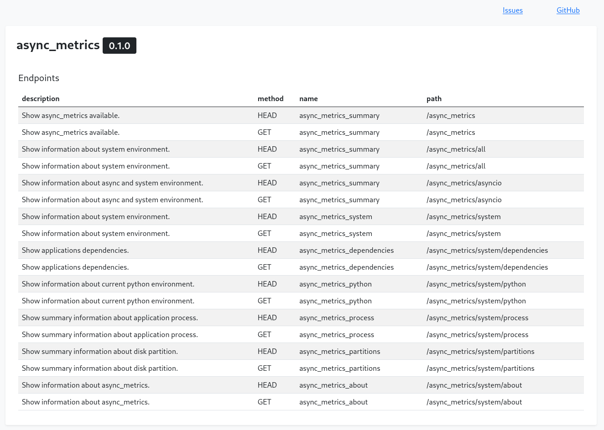

[](https://github.com/amenezes/async_metrics/actions)
[](https://codecov.io/gh/amenezes/async_metrics)
[](https://badge.fury.io/py/async_metrics)

[](https://github.com/psf/black)

# async_metrics

[asyncio](https://docs.python.org/3/library/asyncio.html) metrics for your app.

Available metrics:
- asyncio: event loop status, policy and exception handler and tasks info;
- system: uptime, platform, recursion limit, default encoding, phisical and virtual processors, system load and process user;
- dependencies: application dependencies;
- python: implementation, version and PATH;
- process: application process info like: threads, open files, connections, context switch and childrens PID;
- partitions: partitions usage;
- about: async_metrics version, project: url, issues and release pages.



## Installation

Install and update using pip:

````bash
pip install -U async_metrics
````

## Usage

### AIOHTTP

```python
from aiohttp import web
from async_metrics.ext.aiohttp import setup_async_metrics


app = web.Application()
setup_async_metrics(app)

web.run_app(app, host="0.0.0.0")
```

### Flask

```python
from flask import Flask
from async_metrics.ext.flask import setup_async_metrics

app = Flask(__name__)
setup_async_metrics(app)

@app.route('/')
def hello_world():
    return 'Hello, World!'
```


## Examples

Clone the repository, install the dependencies and follow the following steps:

### AIOHTTP

```bash
python examples/aiohttp_example.py
```

For web UI dashboard access:
- http://localhost:8080/async_metrics/dashboard


### Flask

```bash
FLASK_APP=examples/flask_example.py flask run
```

For web UI dashboard access:
- http://localhost:5000/async_metrics/dashboard


## CLI

### Installation

```bash
pip install async_metrics[cli]
```

### Usage

```bash
python -m async_metrics show -h
Usage: python -m async_metrics show [OPTIONS] [ADDRESS]

Options:
  --asyncio     Show summary information about async environmen.
  --system      Show information about system environment.
  --deps        Show applications dependencies.
  --python      Show information about current python environment.
  --process     Show summary information about application process.
  --partitions  Show summary information about disk partition.
  --about       Show information about async_metrics.
  -h, --help    Show this message and exit.
```

> **ADDRESS** can be set via environment variable `ASYNC_METRICS_HOST`

Acessing AIOHTTP example metrics:

```bash
# default request URL: http://localhost:8080/async_metrics
python -m async_metrics show --system
```

Acessing Flask example metrics:


```bash
python -m async_metrics show http://localhost:5000/async_metrics --system
```

## Links

- License: [Apache License](https://choosealicense.com/licenses/apache-2.0/)
- Code: [https://github.com/amenezes/async_metrics](https://github.com/amenezes/async_metrics)
- Issue tracker: [https://github.com/amenezes/async_metrics/issues](https://github.com/amenezes/async_metrics/issues)
- Docs: [https://github.com/amenezes/async_metrics](https://github.com/amenezes/async_metrics)
